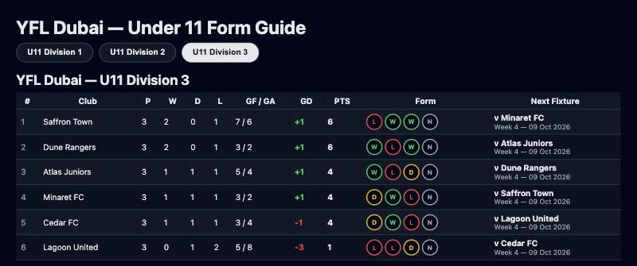

# YFL U11 Form Guide


> [!NOTE]
> **Unofficial.** Not affiliated with YFL or Sportstack. It reads the fixtures API that the YFL LeagueHub site is built on, using a token from **your own** account; follow the league's terms of use.
>
> GitHub **automatically disables scheduled workflows in a repository with no activity for 60 days.** If the Actions tab shows this workflow as disabled, click **Enable workflow** to resume the weekly email.

Every week this builds a **form guide** for the YFL Dubai Under-11 divisions and emails it: the full league table plus a result-by-result run of **W / D / L** for every team, each team's **next fixture**, and a dark-themed HTML report attached for all three divisions. It runs for free on GitHub Actions.

### Contents
[Screenshot](#screenshot) · [How it works](#how-it-works) · [How a table row is worked out](#how-a-table-row-is-worked-out) · [Real examples](#real-examples) · [Configuration](#configuration) · [Setup](#setup) · [Adapting it](#adapting-it-to-another-age-group) · [Tests](#tests) · [Honest limits](#honest-limits) · [Security & privacy](#security--privacy) · [License](#license)

## Screenshot

**Simulated data — fictional clubs, not a real league.** This is the report the code produced from a made-up season, so no real club or result appears. The coloured rings are the form guide, oldest result on the left; the last grey ring is a match not yet played.



## How it works

1. **Fetch.** For each division it requests the division's fixtures from the Sportstack API (tournament IDs 90, 91, 92 = U11 Divisions 1–3), authenticated with a bearer token. There is **no website login and no browser automation**.
2. **Compute.** Standings and form are worked out from those fixtures (see the next section).
3. **Build.** Writes `yfl_u11_form_guide.html` with a tab per division (Division 3 open by default), and a smaller Division 3 table for the email body.
4. **Email.** Sends one email through Gmail's SMTP server, with the division 3 table inline and the full report attached.

The schedule is `0 14 * * TUE` — **Tuesdays 14:00 UTC = 6 PM UAE** — and you can also run it by hand (**Actions → Run workflow**).

## How a table row is worked out

The table is **calculated from the fixtures**, not read from an official league table:

| Rule | Detail |
|---|---|
| Points | win 3, draw 1, loss 0 |
| Order | points, then goal difference, then goals scored, then team name (so it can differ from the league's own tie-breakers, such as head-to-head) |
| Counted | only matches with a recorded score, and not voided or cancelled |
| Team names | a trailing `(D1)`, `(D2)`… is removed |
| Form badges | **W** win · **D** draw · **L** loss · **N** no match that week, not yet played, or finished with no score recorded (hover for which) · **V** voided |
| Last week | the most recent week is left out of everyone's form until at least one match in it has been played |
| Next fixture | each team's earliest *scheduled* match dated today or later |

## Real examples

These cases are asserted by the test suite, using made-up fixtures that can be checked by hand:

| Fixtures | Result |
|---|---|
| A 3–0 B, C 1–1 D, A 2–2 C, B 1–0 D | A: P2 W1 D1 GF 5 GA 2 **+3 · 4 pts** ranks 1st; B 3 pts; C 2 pts; D 1 pt |
| A beat B 2–0, then a 5–0 "win" over C is **voided** | A's table shows only the 2–0; the form shows **W V** |
| A finished a match but **no score was recorded** | not counted in the table, and shown as **N** with a tooltip — it used to appear as a **draw** |
| Two sides tied on points, goal difference and goals | ordered by name, and their positions agree with the display order |
| Scores sent as text, `"10"` v `"9"` | compared as numbers (A wins), not as strings |
| Every fixture's date still "TBC" (start of a season) | builds the table; it used to crash the whole run |
| The API answers 401 | the run stops with a clear error and no email goes out |
| `YFL_USERNAME` / `YFL_PASSWORD` not set | fine — they were required but never used |

## Configuration

Add these under **Settings → Secrets and variables → Actions → Secrets**:

| Secret | Purpose |
|---|---|
| `SPORTSTACK_API_TOKEN` | Bearer token for the Sportstack API, sent as `Authorization: Bearer …`. Use a token from your own account; it can expire, and the run then fails with a 401 |
| `EMAIL_RECEIVER` | One or more addresses, comma-separated |
| `SMTP_USER` | The Gmail address the report is sent from |
| `SMTP_PASS` | A Gmail **app password** (not your normal password) for that address |

`YFL_USERNAME`, `YFL_PASSWORD` and `CLIENT_SECRET_JSON` are **no longer used** — if they still exist in your repository settings you can delete them.

## Setup

<details>
<summary><b>Step by step</b> (click to expand)</summary>

1. Fork this repository.
2. Create a Gmail **app password** (Google Account → Security → 2-Step Verification → App passwords) for the sending address.
3. Add the four secrets above.
4. Run it once by hand: **Actions → YFL U11 Form Guide – Weekly Automation → Run workflow**, and check the email arrives.

To run it locally, export the same names as environment variables, then:

```bash
pip install -r requirements.txt
python main.py
```

</details>

## Adapting it to another age group

Edit the constants in `yfl_scraper.py`:

- `TOURNAMENTS` — `(tournament_id, label, panel_id)` for each division.
- `organizer` and `competition_id` inside `_fetch_fixtures` — currently `yfl` and `4`.
- The default tab and the inline email section are found by the **exact label `"U11 Division 3"`** (in `scrape_all_divisions`); change those two lines if you rename or choose a different division, otherwise the email says "Division 3 data unavailable".

## Tests

```bash
pip install -r requirements.txt
python -m unittest -v
```

17 tests, no network and no credentials: the standings and form maths, the awkward-data cases above, the email assembly (a mocked Gmail server), and `main.py` run end to end against a fake API. The workflow runs them before every email.

## Honest limits

- **It depends on an undocumented API.** If Sportstack changes it, the run fails loudly (any answer other than HTTP 200 stops the job before an email is sent).
- **Tables can differ from the league's official one** when tie-breakers other than goal difference and goals scored decide a position.
- **A team that plays twice in one week** has both matches counted in the table, but only the first appears in its form run.
- **A division with no played match yet** produces an empty table; teams only appear once they have a result.
- **The attached report loads club logos from the web** when opened, so the sender of those images can see that it was opened. The email body itself uses small inline logos the same way.
- **The schedule pauses itself** after 60 days of repository inactivity (see the note at the top). GitHub emails the person who last edited the schedule when a scheduled run fails, depending on their notification settings.

## Security & privacy

- Credentials are GitHub **Actions secrets**, handed to the script as environment variables. Earlier versions copied them into the environment through shell `echo` commands and had a "debug" step that echoed the recipient secret into the run log (GitHub masks it, but there was no reason to print it); both are gone.
- The workflow's token is read-only (`permissions: contents: read`).
- The data is public league information — club names, scores and dates. No player names or personal data are collected or stored, and nothing is kept in this repository.
- The only recipients are the addresses in `EMAIL_RECEIVER`.

## License

[MIT](LICENSE) © 2026 Anvith Yalamanchili
